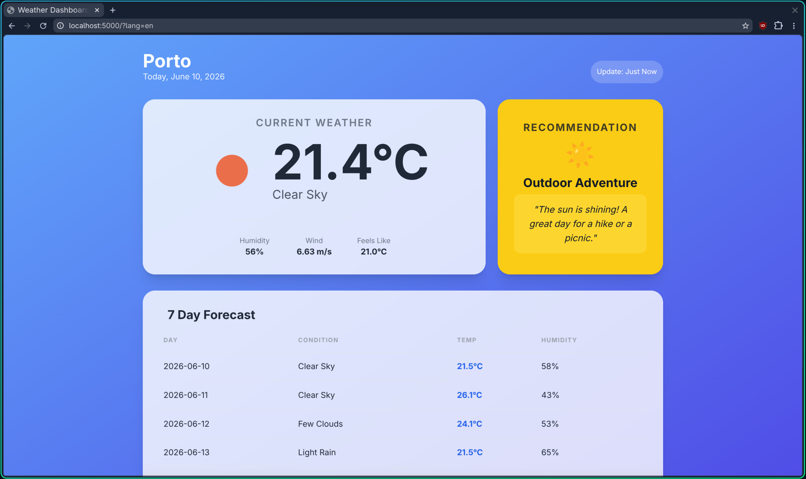

 # 🌦️ Weather Dashboard

A beautiful, responsive weather dashboard built with **Python Flask** and **Tailwind CSS**. This application provides real-time weather updates, a multi-day forecast, and personalized activity recommendations based on current conditions.



## ✨ Features

- **Current Weather**: Real-time temperature, humidity, wind speed, and atmospheric conditions (feels like).
- **7-Day Forecast**: A comprehensive look at the upcoming week's weather trends.
- **Smart Recommendations**: Dynamic activity suggestions (e.g., "Indoor Cozy Vibes" for rain, "Outdoor Adventure" for sunny days) to help you plan your day.
- **Multi-language Support**: Built-in localization supporting English and Portuguese (expandable).
- **Beautiful UI**: A modern "Glassmorphism" design using Tailwind CSS gradients and clean typography.

## 🛠️ Tech Stack

- **Backend**: Python, Flask
- **Frontend**: HTML5, Tailwind CSS, Lucide Icons style
- **API**: OpenWeatherMap API
- **Environment Management**: `python-dotenv` & `uv` (package management)

## 🚀 Getting Started

### Prerequisites
- Python 3.9+
- [uv](https://github.com/astral-sh/uv) package manager installed

### Installation
1. Clone the repository:
   ```bash
   git clone <repository_url>
   cd weather-dasboard
   ```

2. Install dependencies using `uv`:
   ```bash
   uv pip install -r requirements.txt
   ```

3. Setup environment variables:
   Create a `.env` file in the root directory and add your OpenWeatherMap API key:
   ```text
   OPENWEATHER_API_KEY=your_api_key_here
   CITY=London
   UNITS=metric
   ```

4. Run the application:
   ```bash
   uv run python app.py
   ```

### Usage
- Access the dashboard at `http://127.0.0.1:5000`.
- **Switch Languages**: Use the query parameter in your URL (e.g., `?lang=pt\) for Portuguese).
- **Search City**: Append `?q=<city_name>` to search for different locations (e.g., `/?q=Paris`).

## 📝 License
This project is open-source and available under the MIT license.